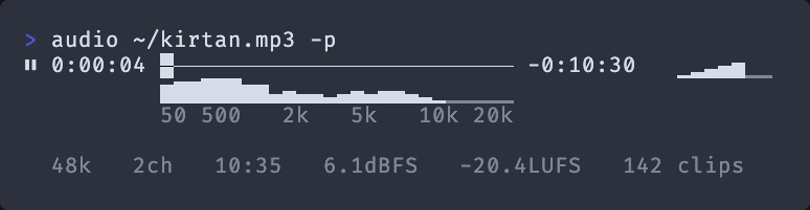

#  audio [](https://github.com/audiojs/audio/actions/workflows/test.yml) [](https://npmjs.org/package/audio)

Audio in JavaScript: load, edit, play, analyze, save, batch-process.

```js
audio('raw-take.wav')
  .trim(-30)
  .normalize('podcast')
  .fade(0.3, 0.5)
  .save('clean.mp3')
```

<!--  -->

* **Universal Format Support** — fast WASM codecs, no ffmpeg.
* **Streaming** — instant playback not waiting for decode.
* **Immutable** — instant edits, safe undo/redo, serializing.
* **Virtual Page cache** — open 10Gb+ files, no 2Gb RAM ceiling.
* **Analysis** — peak, RMS, LUFS, spectrum, clip detection, feature extraction.
* **Modular** – pluggable ops/stats, autodiscovery, tree-shakable.
* **CLI** — builtin player, unix pipelines, globs, tab completion.
* **Isomorphic** — cross-platform: node, browser, electron, deno, bun.
* **Audio-first** – talk dB, Hz, LUFS, not samples, indices or byte arrays.

<!--
* [Architecture](docs/architecture.md) – stream-first design, pages & blocks, non-destructive editing, plan compilation
* [Plugins](docs/plugins.md) – custom ops, stats, descriptors (process, plan, resolve, call), persistent ctx
-->

#### [Quick Start](#quick-start) ǀ [Recipes](#recipes) ǀ [API](#api) ǀ [CLI](#cli) ǀ [Plugins](docs/plugins.md) ǀ [Architecture](docs/architecture.md) ǀ [FAQ](#faq) ǀ [Ecosystem](#ecosystem)


## Quick Start

### Node

`npm i audio`

```js
import audio from 'audio'
let a = audio('voice.mp3')
a.trim().normalize('podcast').fade(0.3, 0.5)
await a.save('clean.mp3')
```

### Browser

```html
<script type="module">
  import audio from './dist/audio.min.js'
  let a = audio('./song.mp3')
  a.trim().normalize().fade(0.5, 2)
  a.clip({ at: 60, duration: 30 }).play()   // play the chorus
</script>
```

Codecs load on demand via `import()` — map them with an import map or your bundler.
<details>
<summary><strong>Import map example</strong></summary>


```html
<script type="importmap">
{
  "imports": {
    "@audio/decode-wav": "https://esm.sh/@audio/decode-wav",
    "@audio/decode-aac": "https://esm.sh/@audio/decode-aac",
    "@audio/decode-aiff": "https://esm.sh/@audio/decode-aiff",
    "@audio/decode-caf": "https://esm.sh/@audio/decode-caf",
    "@audio/decode-webm": "https://esm.sh/@audio/decode-webm",
    "@audio/decode-amr": "https://esm.sh/@audio/decode-amr",
    "@audio/decode-wma": "https://esm.sh/@audio/decode-wma",
    "mpg123-decoder": "https://esm.sh/mpg123-decoder",
    "@wasm-audio-decoders/flac": "https://esm.sh/@wasm-audio-decoders/flac",
    "ogg-opus-decoder": "https://esm.sh/ogg-opus-decoder",
    "@wasm-audio-decoders/ogg-vorbis": "https://esm.sh/@wasm-audio-decoders/ogg-vorbis",
    "qoa-format": "https://esm.sh/qoa-format",
    "@audio/encode-wav": "https://esm.sh/@audio/encode-wav",
    "@audio/encode-mp3": "https://esm.sh/@audio/encode-mp3",
    "@audio/encode-flac": "https://esm.sh/@audio/encode-flac",
    "@audio/encode-opus": "https://esm.sh/@audio/encode-opus",
    "@audio/encode-ogg": "https://esm.sh/@audio/encode-ogg",
    "@audio/encode-aiff": "https://esm.sh/@audio/encode-aiff"
  }
}
</script>
```

</details>

### CLI

```sh
npm i -g audio
audio voice.wav trim normalize podcast fade 0.3s -0.5s -o clean.mp3
```

## Recipes

### Clean up a recording

```js
let a = audio('raw-take.wav')
a.trim(-30).normalize('podcast').fade(0.3, 0.5)
await a.save('clean.wav')
```

### Podcast montage

```js
let intro = audio('intro.mp3')
let body  = audio('interview.wav')
let outro = audio('outro.mp3')

body.trim().normalize('podcast')
let ep = audio([intro, body, outro])
ep.fade(0.5, 2)
await ep.save('episode.mp3')
```

### Render a waveform

```js
let a = audio('track.mp3')
let [mins, peaks] = await a.stat(['min', 'max'], { bins: canvas.width })
for (let i = 0; i < peaks.length; i++)
  ctx.fillRect(i, h/2 - peaks[i] * h/2, 1, (peaks[i] - mins[i]) * h/2)
```

### Render as it decodes

```js
let a = audio('long.flac')
a.on('data', ({ delta }) => appendBars(delta.max[0], delta.min[0]))
await a
```

### Voiceover on music

```js
let music = audio('bg.mp3')
let voice = audio('narration.wav')
music.gain(-12).mix(voice, { at: 2 })
await music.save('mixed.wav')
```

### Split a long file

```js
let a = audio('audiobook.mp3')
let [ch1, ch2, ch3] = a.split(1800, 3600)
for (let [i, ch] of [ch1, ch2, ch3].entries())
  await ch.save(`chapter-${i + 1}.mp3`)
```

### Record from mic

```js
let a = audio()
a.record()
await new Promise(r => setTimeout(r, 5000))
a.stop()
a.trim().normalize()
await a.save('recording.wav')
```

### Extract features for ML

```js
let a = audio('speech.wav')
let mfcc = await a.stat('cepstrum', { bins: 13 })
let spec = await a.stat('spectrum', { bins: 128 })
let [loud, rms] = await a.stat(['loudness', 'rms'])
```

### Generate a tone

```js
let a = audio.from(t => Math.sin(440 * Math.PI * 2 * t), { duration: 2 })
await a.save('440hz.wav')
```

### Custom op

```js
audio.op('crush', (chs, ctx) => {
  let steps = 2 ** (ctx.args[0] ?? 8)
  return chs.map(ch => ch.map(s => Math.round(s * steps) / steps))
})

a.crush(4)
```

### Serialize and restore

```js
let json = JSON.stringify(a)             // { source, edits, ... }
let b = audio(JSON.parse(json))           // re-decode + replay edits
```

### Remove a section

```js
let a = audio('interview.wav')
a.remove({ at: 120, duration: 15 })     // cut 2:00–2:15
a.fade(0.1, { at: 120 })                // smooth the splice
await a.save('edited.wav')
```

### Ringtone from any song

```js
let a = audio('song.mp3')
a.crop({ at: 45, duration: 30 }).fade(0.5, 2).normalize()
await a.save('ringtone.mp3')
```

### Detect clipping

```js
let a = audio('master.wav')
let clips = await a.stat('clipping')
if (clips.length) console.warn(`${clips.length} clipped blocks`)
```

### Stream to network

```js
let a = audio('2hour-mix.flac')
a.highpass(40).normalize('broadcast')
for await (let chunk of a) socket.send(chunk[0].buffer)
```

### Glitch: stutter + reverse

```js
let a = audio('beat.wav')
let v = a.clip({ at: 1, duration: 0.25 })
let glitch = audio([v, v, v, v])
glitch.reverse({ at: 0.25, duration: 0.25 })
await glitch.save('glitch.wav')
```

### Tremolo / sidechain

```js
let a = audio('pad.wav')
a.gain(t => -12 * (0.5 + 0.5 * Math.cos(t * Math.PI * 4)))  // 2Hz tremolo in dB
await a.save('tremolo.wav')
```

### Sonify data

```js
let prices = [100, 102, 98, 105, 110, 95, 88, 92, 101, 107]
let a = audio.from(t => {
  let freq = 200 + (prices[Math.min(Math.floor(t / 0.2), prices.length - 1)] - 80) * 10
  return Math.sin(freq * Math.PI * 2 * t) * 0.5
}, { duration: prices.length * 0.2 })
await a.save('sonification.wav')
```


## API

### Create

* **`audio(source, opts?)`** – decode from file, URL, or bytes. Returns instantly — decodes in background.
* **`audio.from(source, opts?)`** – wrap existing PCM, AudioBuffer, silence, or function. Sync, no I/O.

```js
let a = audio('voice.mp3')                // file path
let b = audio('https://cdn.ex/track.mp3') // URL
let c = audio(inputEl.files[0])           // Blob, File, Response, ArrayBuffer
let d = audio()                           // empty, ready for .push() or .record()
let e = audio([intro, body, outro])       // concat (virtual, no copy)
// opts: { sampleRate, channels, storage: 'memory' | 'persistent' | 'auto' }

await a    // await for decode — if you need .duration, full stats etc

let a = audio.from([left, right])                 // Float32Array[] channels
let b = audio.from(3, { channels: 2 })           // 3s silence
let c = audio.from(t => Math.sin(440*TAU*t), { duration: 2 })  // generator
let d = audio.from(audioBuffer)                   // Web Audio AudioBuffer
let e = audio.from(int16arr, { format: 'int16' }) // typed array + format
```


### Properties

```js
// format
a.duration                // total seconds (reflects edits)
a.channels                // channel count
a.sampleRate              // sample rate
a.length                  // total samples per channel

// playback
a.currentTime             // position in seconds
a.playing                 // true during playback
a.paused                  // true when paused
a.volume = -3             // dB (settable)
a.loop = true             // on/off (settable)
a.recording               // true during mic recording

// state
a.ready                   // promise, resolves when fully decoded
a.source                  // original source reference
a.pages                   // Float32Array page store
a.stats                   // per-block stats (peak, rms, etc.)
a.edits                   // edit list (non-destructive ops)
a.version                 // increments on each edit
```

### Structure

Non-destructive time/channel rearrangement. All support `{at, duration, channel}`.

* **`.trim(threshold?)`** – strip leading/trailing silence (dB, default auto).
* **`.crop({at, duration})`** – keep range, discard rest.
* **`.remove({at, duration})`** – cut range, close gap.
* **`.insert(source, {at})`** – insert audio or silence (number of seconds) at position.
* **`.clip({at, duration})`** – zero-copy range reference.
* **`.split(...offsets)`** – zero-copy split at timestamps.
* **`.pad(before, after?)`** – silence at edges (seconds).
* **`.repeat(n)`** – repeat n times.
* **`.reverse({at?, duration?})`** – reverse audio or range.
* **`.speed(rate)`** – playback speed (affects pitch and duration).
* **`.remix(channels)`** – channel count: number or array map (`[1, 0]` swaps L/R).

```js
a.trim(-30)                               // strip silence below -30dB
a.remove({ at: '2m', duration: 15 })      // cut 2:00–2:15, close gap
a.insert(intro, { at: 0 })               // prepend; .insert(3) appends 3s silence
let [pt1, pt2] = a.split('30m')          // zero-copy views
let hook = a.clip({ at: 60, duration: 30 })  // zero-copy excerpt
a.remix([0, 0])                           // L→both; .remix(1) for mono
```

### Process

Amplitude, mixing, normalization. All support `{at, duration, channel}` ranges.

* **`.gain(dB, opts?)`** – volume. Number, range, or `t => dB` function. `{ unit: 'linear' }` for multiplier.
* **`.fade(in, out?, curve?)`** – fade in/out. Curves: `'linear'` `'exp'` `'log'` `'cos'`.
* **`.normalize(target?)`** – remove DC offset, clamp, and normalize loudness.
  * `'podcast'` – -16 LUFS, -1 dBTP.
  * `'streaming'` – -14 LUFS.
  * `'broadcast'` – -23 LUFS.
  * `-3` – custom dB target (peak mode).
  * no arg – peak 0dBFS.
  * `{ mode: 'rms' }` – RMS normalization. Also `'peak'`, `'lufs'`.
  * `{ ceiling: -1 }` – true peak limiter in dB.
  * `{ dc: false }` – skip DC removal.
* **`.mix(source, opts?)`** – overlay another audio (additive).
* **`.pan(value, opts?)`** – stereo balance (−1 left, 0 center, 1 right). Accepts function.
* **`.write(data, {at?})`** – overwrite samples with raw PCM.
* **`.transform(fn)`** – inline processor: `(chs, ctx) => chs`. Not serialized.

```js
a.gain(-3)                                // reduce 3dB
a.gain(6, { at: 10, duration: 5 })       // boost range
a.gain(t => -12 * Math.cos(t * TAU))     // automate over time
a.fade(0.5, -2, 'exp')                    // 0.5s in, 2s exp fade-out
a.normalize('podcast')                    // -16 LUFS; also 'streaming', 'broadcast'
a.mix(voice, { at: 2 })                  // overlay at 2s
a.pan(-0.3, { at: 10, duration: 5 })      // pan left for range
```

### Filter

Biquad filters, chainable. All support `{at, duration}` ranges.

* **`.highpass(freq)`**, **`.lowpass(freq)`** – pass filter.
* **`.bandpass(freq, Q?)`**, **`.notch(freq, Q?)`** – band-pass / notch.
* **`.lowshelf(freq, dB)`**, **`.highshelf(freq, dB)`** – shelf EQ.
* **`.eq(freq, gain, Q?)`** – parametric EQ.
* **`.filter(type, ...params)`** – generic dispatch.

```js
a.highpass(80).lowshelf(200, -3)          // rumble + mud
a.eq(3000, 2, 1.5).highshelf(8000, 3)    // presence + air
a.notch(50)                               // remove hum
a.filter(customFn, { cutoff: 2000 })     // custom filter function
```

### I/O

Read PCM, encode, stream, push. Format inferred from extension.

* **`await .read(opts?)`** – rendered PCM. `{ format, channel }` to convert.
* **`await .save(path, opts?)`** – encode + write. `{ at, duration }` for sub-range.
* **`await .encode(format?, opts?)`** – encode to `Uint8Array`.
* **`for await (let block of a)`** – async-iterable over blocks.
* **`.clone()`** – deep copy, independent edits, shared pages.
* **`.push(data, format?)`** – feed PCM into pushable instance. `.stop()` to finalize.

```js
let pcm = await a.read()                  // Float32Array[]
let raw = await a.read({ format: 'int16', channel: 0 })
await a.save('out.mp3')                   // format from extension
let bytes = await a.encode('flac')        // Uint8Array
for await (let block of a) send(block)    // stream blocks
let b = a.clone()                         // independent copy, shared pages

let src = audio()                         // pushable source
src.push(buf, 'int16')                    // feed PCM
src.stop()                                // finalize
```

### Playback / Recording

Live playback with dB volume, seeking, looping. Mic recording via `audio-mic`.

* **`.play(opts?)`** – start playback. `{ at, duration, volume, loop }`.
* **`.pause()`**, **`.resume()`**, **`.seek(t)`**, **`.stop()`** – playback control.
* **`.record(opts?)`** – mic recording. `{ deviceId, sampleRate, channels }`.

```js
a.play({ at: 30, duration: 10 })          // play 30s–40s
a.volume = -6; a.loop = true              // live adjustments
a.pause(); a.seek(60); a.resume()         // jump to 1:00
a.stop()                                  // end playback or recording

let mic = audio()
mic.record({ sampleRate: 16000, channels: 1 })
mic.stop()
```


### Analysis

`await .stat(name, opts?)` — without `bins` returns scalar, with `bins` returns `Float32Array`. Array of names returns array of results. Sub-ranges via `{at, duration}`, per-channel via `{channel}`.

* **`'db'`** – peak amplitude in dBFS.
* **`'rms'`** – RMS amplitude (linear).
* **`'loudness'`** – integrated LUFS (ITU-R BS.1770).
* **`'dc'`** – DC offset.
* **`'clipping'`** – clipped samples (scalar: timestamps, binned: counts).
* **`'silence'`** – silent ranges as `{at, duration}`.
* **`'max'`**, **`'min'`** – peak envelope (use together for waveform rendering).
* **`'spectrum'`** – mel-frequency spectrum in dB (A-weighted).
* **`'cepstrum'`** – MFCCs.

```js
let loud = await a.stat('loudness')                       // LUFS
let [db, clips] = await a.stat(['db', 'clipping'])        // multiple at once
let spec = await a.stat('spectrum', { bins: 128 })        // frequency bins
let peaks = await a.stat('max', { bins: 800 })            // waveform data
await a.stat('rms', { channel: 0 })                       // left only → number
await a.stat('rms', { channel: [0, 1] })                  // per-channel → [n, n]
let gaps = await a.stat('silence', { threshold: -40 })    // [{at, duration}, ...]
```


### Utility

Events, lifecycle, undo/redo, serialization.

* **`.on(event, fn)`** / **`.off(event?, fn?)`** – subscribe / unsubscribe.
  * `'data'` – pages decoded/pushed. Payload: `{ delta, offset, sampleRate, channels }`.
  * `'change'` – any edit or undo.
  * `'metadata'` – stream header decoded. Payload: `{ sampleRate, channels }`.
  * `'timeupdate'` – playback position. Payload: `currentTime`.
  * `'ended'` – playback finished (not on loop).
  * `'progress'` – during save/encode. Payload: `{ offset, total }` in seconds.
* **`.dispose()`** – release resources. Supports `using` for auto-dispose.
* **`.undo(n?)`** – undo last edit(s). Returns edit for redo via `.run()`.
* **`.run(...edits)`** – apply edit objects `{ type, args, at?, duration? }`. Batch or replay.

```js
a.on('data', ({ delta }) => draw(delta))  // decode progress
a.on('timeupdate', t => ui.update(t))     // playback position

a.undo()                                  // undo last edit
b.run(...a.edits)                         // replay onto another file
JSON.stringify(a); audio(json)            // serialize / restore
```

### Plugins

Extend with custom ops and stats. See [Plugin Tutorial](docs/plugins.md).

* **`audio.op(name, fn)`** – register op. Shorthand for `{ process: fn }`. Full descriptor: `{ process, plan, resolve, call }`.
* **`audio.op(name)`** – query descriptor. **`audio.op()`** – all ops.
* **`audio.stat(name, descriptor)`** – register stat. Shorthand `(chs, ctx) => [...]` or `{ block, reduce, query }`.

```js
// op: process function receives (channels[], ctx) per 1024-sample block
audio.op('crush', (chs, ctx) => {
  let steps = 2 ** (ctx.args[0] ?? 8)
  return chs.map(ch => ch.map(s => Math.round(s * steps) / steps))
})

// stat: block function collects per-block, reduce enables scalar queries
audio.stat('peak', {
  block: (chs) => chs.map(ch => { let m = 0; for (let s of ch) m = Math.max(m, Math.abs(s)); return m }),
  reduce: (src, from, to) => { let m = 0; for (let i = from; i < to; i++) m = Math.max(m, src[i]); return m },
})

a.crush(4)                    // chainable like built-in ops
a.stat('peak')                // → scalar from reduce
a.stat('peak', { bins: 100 }) // → binned array
```

## CLI


```sh
npx audio [file] [ops...] [-o output] [options]

# ops
eq          mix         pad         pan       crop
fade        gain        stat        trim      notch
remix       speed       split       insert    remove
repeat      bandpass    highpass    lowpass   reverse
lowshelf    highshelf   normalize
```


`-o` output · `-p` play · `-f` force · `--format` · `--verbose` · `+` concat

### Playback




<!-- ```sh
npx audio kirtan.mp3
▶ 0:06:37 ━━━━━━━━────────────────────────────────────────── -0:36:30   ▁▂▃▄▅__
          ▂▅▇▇██▇▆▇▇▇██▆▇▇▇▆▆▅▅▆▅▆▆▅▅▆▅▅▅▃▂▂▂▂▁_____________
          50    500  1k     2k         5k       10k      20k

          48k   2ch   43:07   -0.8dBFS   -30.8LUFS
``` -->

<kbd>␣</kbd> pause · <kbd>←</kbd>/<kbd>→</kbd> seek ±10s · <kbd>⇧←</kbd>/<kbd>⇧→</kbd> seek ±60s · <kbd>↑</kbd>/<kbd>↓</kbd> volume ±3dB · <kbd>l</kbd> loop · <kbd>q</kbd> quit


### Edit

```sh
# clean up
npx audio raw-take.wav trim -30db normalize podcast fade 0.3s -0.5s -o clean.wav

# ranges
npx audio in.wav gain -3db 1s..10s -o out.wav

# filter chain
npx audio in.mp3 highpass 80hz lowshelf 200hz -3db -o out.wav

# join
npx audio intro.mp3 + content.wav + outro.mp3 trim normalize fade 0.5s -2s -o ep.mp3

# voiceover
npx audio bg.mp3 gain -12db mix narration.wav 2s -o mixed.wav

# split
npx audio audiobook.mp3 split 30m 60m -o 'chapter-{i}.mp3'
```

### Analysis

```sh
# all default stats (db, rms, loudness, clipping, dc)
npx audio speech.wav stat

# specific stats
npx audio speech.wav stat loudness rms

# spectrum / cepstrum with bin count
npx audio speech.wav stat spectrum 128
npx audio speech.wav stat cepstrum 13

# stat after transforms
npx audio speech.wav gain -3db stat db
```

### Batch

```sh
npx audio '*.wav' trim normalize podcast -o '{name}.clean.{ext}'
npx audio '*.wav' gain -3db -o '{name}.out.{ext}'
```

### Stdin/stdout

```sh
cat in.wav | audio gain -3db > out.wav
curl -s https://example.com/speech.mp3 | npx audio normalize -o clean.wav
ffmpeg -i video.mp4 -f wav - | npx audio trim normalize podcast > voice.wav
```

### Tab completion

```sh
eval "$(audio --completions zsh)"       # add to ~/.zshrc
eval "$(audio --completions bash)"      # add to ~/.bashrc
audio --completions fish | source       # fish
```


## FAQ

<dl>
<dt>How is this different from Web Audio API?</dt>
<dd>Web Audio API is a real-time graph for playback and synthesis. This is for loading, editing, analyzing, and saving audio files. They work well together. For Web Audio API in Node, see <a href="https://github.com/audiojs/web-audio-api">web-audio-api</a>.</dd>

<dt>What formats are supported?</dt>
<dd>Decode: WAV, MP3, FLAC, OGG Vorbis, Opus, AAC, AIFF, CAF, WebM, AMR, WMA, QOA via <a href="https://github.com/audiojs/audio-decode">audio-decode</a>. Encode: WAV, MP3, FLAC, Opus, OGG, AIFF via <a href="https://github.com/audiojs/audio-encode">audio-encode</a>. Codecs are WASM-based, lazy-loaded on first use.</dd>

<dt>Does it need ffmpeg or native addons?</dt>
<dd>No, pure JS + WASM. For CLI, you can install globally: <code>npm i -g audio</code>.</dd>

<dt>How big is the bundle?</dt>
<dd>~20K gzipped core. Codecs load on demand via <code>import()</code>, so unused formats aren't fetched.</dd>

<dt>How does it handle large files?</dt>
<dd>Audio is stored in fixed-size pages. In the browser, cold pages can evict to OPFS when memory exceeds budget. Stats stay resident (~7 MB for 2h stereo).</dd>

<dt>Are edits destructive?</dt>
<dd>No. <code>a.gain(-3).trim()</code> pushes entries to an edit list — source pages aren't touched. Edits replay on <code>read()</code> / <code>save()</code> / <code>for await</code>.</dd>

<dt>Can I use it in the browser?</dt>
<dd>Yes, same API. See <a href="#browser">Browser</a> for bundle options and import maps.</dd>

<dt>Does it need the full file before I can work with it?</dt>
<dd>No, playback and edits work during decode. The <code>'data'</code> event fires as pages arrive.</dd>

<dt>TypeScript?</dt>
<dd>Yes, ships with <code>audio.d.ts</code>.</dd>
</dl>


## Ecosystem

* [audio-decode](https://github.com/audiojs/audio-decode) – codec decoding (13+ formats)
* [encode-audio](https://github.com/audiojs/audio-encode) – codec encoding
* [audio-filter](https://github.com/audiojs/audio-filter) – filters (weighting, EQ, auditory)
* [audio-speaker](https://github.com/audiojs/audio-speaker) – audio output (Node)
* [audio-type](https://github.com/nickolanack/audio-type) – format detection
* [pcm-convert](https://github.com/nickolanack/pcm-convert) – PCM format conversion

<p align="center"><a href="./license.md">MIT</a> · <a href="https://github.com/krishnized/license">ॐ</a></p>
