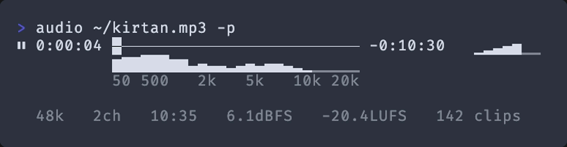

# audio [](https://github.com/audiojs/audio/actions/workflows/test.yml) [](https://npmjs.org/package/audio)

_Audio playback, editing and analysis_

<!--  -->

* **Any Format** — fast [wasm codecs](https://github.com/audiojs/decode), no ffmpeg.
* **Non-destructive** — virtual edits, infinite undo, instant clone.
* **Stream-first** — playback/encode during decode, realtime editing.
* **Paged** — no 2Gb memory limit, open 10Gb+ files.
* **Analysis** — loudness, spectrum, beats, pitch, chords, key.
* **Modular** – pluggable ops, tree-shakable.
* **CLI** — playback, batch processing, scripting, unix pipes, tab completion.
* **Cross-platform** — browsers, node, deno, bun.

<!--
* [Architecture](docs/architecture.md) – stream-first design, pages & blocks, non-destructive editing, plan compilation
* [Plugins](docs/plugins.md) – custom ops, stats, descriptors (process, plan, resolve, call), persistent ctx
-->
<div align=center>

<br>
<a href="https://www.npmjs.com/package/audio"></a>

#### [Start](#start)&nbsp;&nbsp;&nbsp;[Recipes](#recipes)&nbsp;&nbsp;&nbsp;[API](#api)&nbsp;&nbsp;&nbsp;[CLI](#cli)&nbsp;&nbsp;&nbsp;[FAQ](#faq)&nbsp;&nbsp;&nbsp;[Plugins](docs/plugins.md)&nbsp;&nbsp;&nbsp;[Architecture](docs/architecture.md)&nbsp;&nbsp;&nbsp;[Comparison](docs/comparison.md)

</div>


## Start

### Node

`npm i audio`

```js
import audio from 'audio'
audio('voice.mp3').trim().normalize('podcast').fade(0.3, 0.5).save('clean.mp3')
```

### Browser

<details><summary>CDN</summary>

```html
<script type="module">
  import audio from 'https://esm.sh/audio'
  audio('./song.mp3').trim().normalize().fade(0.5, 2).clip({ at: 60, duration: 30 }).play()
</script>
```

</details>

<details><summary>Bundler</summary>

`import audio from 'audio'` in Vite, esbuild or webpack; codecs and plugins become code-split chunks, fetched on demand. Subpath imports (`audio/core`, `audio/fn/gain`) are source ESM and need a bundler.

</details>


### CLI

```sh
npm i -g audio  # or: npx audio …
audio voice.wav trim normalize podcast fade 0.3s -0.5s save clean.mp3
```

### AI

Agents run the [CLI](#cli): measure, edit, save to a new file, measure again. One page teaches them the grammar and loudness targets: [skills/audio/SKILL.md](skills/audio/SKILL.md).

Coding agents with a shell (Claude Code, Codex) take it as a skill:

```sh
npx skills add audiojs/audio
```

Chat apps (Claude Desktop, Cursor, VS Code) get it as an MCP server, one tool that takes CLI arguments:

```json
{ "mcpServers": { "audio": { "command": "npx", "args": ["-y", "audio", "--mcp"] } } }
```

Claude Code: `claude mcp add audio -- npx -y audio --mcp`. Plugins (compressor, declick, ducker…) install with `audio` and load on first use.

Then ask: *"make ~/Desktop/interview.m4a podcast-ready and tell me the loudness before and after"*.


## Recipes

### Clean up

```js
// master a raw take
let a = audio('raw-take.wav')
a.trim(-30).normalize('podcast').fade(0.3, 0.5)
await a.save('clean.wav')

// full restoration chain via ecosystem plugins (see API › Plugins)
a.gate(-45).dehum().deesser().compressor({ threshold: -18 }).limiter({ ceiling: -1 })

// cut 2:00–2:15, smooth the splice
a.remove({ at: 120, duration: 15 }).fade(0.1, { at: 120 })

// find clipped blocks
let clips = await a.stat('clipping')
```

### Compose

```js
// podcast montage
let ep = audio([intro, interview.trim().normalize('podcast'), outro], { crossfade: 0.5 })
await ep.save('episode.mp3')

// voiceover over music
music.gain(-12).mix(voice, { at: 2 })

// ringtone: the chorus + fades
audio('song.mp3').crop({ at: 45, duration: 30 }).fade(0.5, 2).normalize().save('ringtone.mp3')

// split an audiobook into chapters
let [ch1, ch2, ch3] = audio('audiobook.mp3').split(1800, 3600)

// glitch: stutter + reverse
let v = a.clip({ at: 1, duration: 0.25 })
audio([v, v, v, v]).reverse({ at: 0.25, duration: 0.25 })
```

### Analyze

```js
// waveform bars — and progressively, as it decodes
let [mins, peaks] = await a.stat(['min', 'max'], { bins: canvas.width })
a.on('data', ({ delta }) => appendBars(delta.max[0], delta.min[0]))

// features for ML
let mfcc = await a.stat('cepstrum', { bins: 13 })
let [loud, rms] = await a.stat(['loudness', 'rms'])

// notes, chords, key
let notes = await a.stat('notes')    // [{time, duration, freq, midi, note, clarity}]
let chords = await a.stat('chords')  // [{time, duration, label, root, quality, confidence}]
let key = await a.stat('key')        // {tonic, mode, label, confidence}
```

### Record & generate

```js
// mic take
let a = audio()
a.record()
// …later
a.stop()
a.trim().normalize()

// tone — any t => sample function
let tone = audio.from(t => Math.sin(440 * Math.PI * 2 * t), { duration: 2 })

// sonify data
let s = audio.from(t => Math.sin((200 + data[t / 0.2 | 0]) * Math.PI * 2 * t) * 0.5, { duration: data.length * 0.2 })
```

### Automate

```js
a.gain(t => -12 * (0.5 + 0.5 * Math.cos(t * Math.PI * 4)))  // 2Hz tremolo in dB
a.lowpass(t => 400 + 4000 * t)                              // filter sweep
a.pan({ t: [0, 2, 4], v: [-1, 1, -1] })                     // curve L→R→L over 4s, serializable
music.ducker({ key: voice })                                // sidechain (plugin)
```

### Stream & persist

```js
// stream to network — encode/playback during decode
for await (let chunk of audio('2hour-mix.flac').highpass(40)) socket.send(chunk[0].buffer)

// serialize edits, restore later
let json = JSON.stringify(a)     // { source, edits, ... }
let b = audio(JSON.parse(json))  // re-decode + replay edits
```


## API

### Create

| Method                         | Description                                                                                                                         |
|:--|:--|
| `audio(source, opts?)` | decode from file, URL, bytes, or a byte stream. Returns instantly — decodes in background; streams decode as they arrive. |
| `audio.from(source, opts?)` | wrap existing PCM, AudioBuffer, silence, or function. Sync, no I/O. |

```js
let a = audio('voice.mp3')                // file path
let b = audio('https://cdn.ex/track.mp3') // URL
let c = audio(inputEl.files[0])           // Blob, File, Response, ArrayBuffer
let d = audio()                           // empty, ready for .push() or .record()
let e = audio([intro, body, outro])       // concat (virtual, no copy)
let f = audio([a, b, c], { crossfade: 2 })  // concat with 2s crossfade
let g = audio(process.stdin)              // byte stream: pipe, socket, fetch body – decodes as it arrives
// opts: { sampleRate, channels, crossfade, curve, storage: 'memory' | 'persistent' | 'auto' }

await a    // await for decode — if you need .duration, full stats etc

let a = audio.from([left, right])                 // Float32Array[] channels
let b = audio.from(3, { channels: 2 })           // 3s silence
let c = audio.from(t => Math.sin(440*TAU*t), { duration: 2 })  // generator
let d = audio.from(audioBuffer)                   // Web Audio AudioBuffer
let e = audio.from(int16arr, { format: 'int16' }) // typed array + format
```

### Properties

| Property                         | Description                                                                                                                         |
|:--|:--|
| `.duration` | total seconds, after edits. |
| `.channels` | channel count. |
| `.sampleRate` | sample rate. |
| `.length` | samples per channel. |
| `.currentTime` | playback position in seconds, smooth during playback. |
| `.playing` | true during playback. |
| `.paused` | true when paused. |
| `.volume` | 0..1 linear. Settable. |
| `.muted` | mute, independent of volume. Settable. |
| `.loop` | settable. |
| `.playbackRate` | 0.0625..16, settable mid-playback; ramps click-free (~50ms varispeed). `.speed()` bakes it. |
| `.ended` | true when playback reached the end, not after `stop()`. |
| `.seeking` | true during a seek. |
| `.played` | promise, resolves when playback starts. |
| `.recording` | true during mic recording. |
| `.ready` | promise, resolves when fully decoded. |
| `.source` | original source. |
| `.bitDepth` | stored sample depth of the source: 16, 24, 32 (float); null for lossy or generated audio. Lossless `save` keeps it. |
| `.pages` | `Float32Array` page store. |
| `.stats` | per-block stats (peak, rms, etc.). |
| `.edits` | edit list. |
| `.version` | increments on each edit. |

### Structure

| Method                         | Description                                                                                                                         |
|:--|:--|
| `.trim(threshold?)` | strip leading/trailing silence (dB, default auto). On a live stream a given threshold streams, holding a silent tail until sound resumes; the automatic one reads the whole input, so it waits for the end. |
| `.shrink(gap?, threshold?)` | shorten silent pauses to `gap` seconds (default 0.3); `0` removes them. Streams with a given threshold, like `trim`.<br><sub>≡ FFmpeg `silenceremove`, Audacity truncate-silence</sub> |
| `.crop({at, duration})` | keep range, discard rest. |
| `.remove(at, duration, crossfade?)` | delete range, close gap. `crossfade` (`'10ms'`) makes the splice an equal-power crossfade centered on the cut; the length stays the same. |
| `.insert(source, at?, crossfade?)` | insert audio (default: at end), or a number of seconds of silence; `crossfade` fades both seams. |
| `.copy({at?, duration?})` | copy range (default: all) to this instance's clipboard. |
| `.cut({at?, duration?, crossfade?})` | copy, then remove. |
| `.paste({at?, crossfade?})` | insert the clipboard (default: at end). |
| `.clip({at, duration})` | zero-copy excerpt as a new instance. |
| `.split(...offsets)` | zero-copy excerpts between timestamps. |
| `.pad(before, after?)` | silence at edges (seconds). |
| `.repeat(n)` | repeat n times. |
| `.reverse({at?, duration?})` | reverse audio or range. |
| `.speed(rate)` | changes pitch and duration together. |
| `.stretch(factor)` | changes duration, keeps pitch (phase-locked vocoder). A `t => f` or `{t, v}` factor slides the tempo; duration becomes ∫factor dt. |
| `.pitch(semitones)` | changes pitch, keeps duration. |
| `.remix(channels)` | channel count, or a map: `[1, 0]` swaps L/R. |

Every op takes a trailing `{at, duration, channel}` range, except channel-changing `remix` and `crossover`. Times are seconds or strings (`'1:30'`, `'2m'`); negative counts from the end.

```js
a.trim(-30)                               // strip silence below -30dB
a.remove({ at: '2m', duration: 15 })      // delete 2:00–2:15, close gap
a.remove(12.3, 0.4, '10ms')               // cut a breath, crossfaded: no click
a.insert(intro, { at: 0 })                // prepend; .insert(3) appends 3s silence
a.copy(60, 30).paste(120)                 // duplicate the chorus at 2:00
a.cut(2, 1).paste(5)                      // move 2s–3s to 5s of the shortened timeline
let [pt1, pt2] = a.split('30m')           // zero-copy parts
let hook = a.clip({ at: 60, duration: 30 })  // zero-copy excerpt
a.stretch(1.1)                            // 10% longer, same pitch
a.pitch(-2)                               // 2 semitones down, same tempo
a.remix([0, 0])                           // L→both; .remix(1) for mono
```

### Process

| Method                         | Description                                                                                                                         |
|:--|:--|
| `.gain(dB, opts?)` | `{ unit: 'linear' }` takes a multiplier. |
| `.fade(in, out?, curve?)` | curves `'linear'` `'exp'` `'log'` `'cos'`. `{start, end}` levels 0..1 fade between any levels (a duck); `{mid}` skews the half-amplitude point.<br><sub>≡ Audacity adjustable-fade</sub> |
| `.normalize(target?, mode?)` | remove DC, normalize. Loudness targets hold a true-peak ceiling, -1 dBTP by default: a lookahead limiter, then the loudness it took made back up. Presets per Apple Podcasts, Spotify, EBU R 128 (ITU-R BS.1770-4):<br>`'podcast'` -16 LUFS<br>`'streaming'` -14 LUFS<br>`'broadcast'` -23 LUFS<br>`-18, 'lufs'` any loudness; `-3` peak dB; no arg: peak 0 dBFS; `'rms'` mode<br>`{ ceiling: -2 }` dBTP, `false` off<br>`{ dc: false }` keep DC<br>`{ adaptive: true }` on a live stream, start at once: the gain follows what it has heard, the ceiling (the target itself in peak mode) guards what it hasn't. Without it, one gain for the whole selection: a live stream waits for its end.<br><sub>≡ FFmpeg `loudnorm`</sub> |
| `.mix(source, at?, gain?)` | overlay at `at` seconds, source level `gain` dB.<br><sub>≡ FFmpeg `amix` weights</sub> |
| `.crossfade(source, duration?, curve?)` | append with overlap, default 0.5s. `'cos'` (default) suits similar material; `'equal'` (equal-power) keeps loudness across unrelated tracks.<br><sub>≡ FFmpeg `acrossfade`</sub> |
| `.pan(value, opts?)` | −1 left, 0 center, 1 right. |
| `.write(data, {at?})` | overwrite samples with raw PCM. |
| `.transform(fn)` | inline `(input, output, ctx) => void`. Not serialized. |

```js
a.gain(-3)                                // reduce 3dB
a.gain(6, { at: 10, duration: 5 })        // boost range
a.gain(t => -12 * Math.cos(t * TAU))      // automate over time
a.fade(0.5, -2, 'exp')                    // 0.5s in, 2s exp fade-out
a.normalize('podcast')                    // -16 LUFS, -1 dBTP
a.normalize(-27, 'lufs', { ceiling: -2 }) // Netflix
a.mix(voice, { at: 2 })                   // overlay at 2s
a.mix(bed, 0, -18)                        // music bed, 18 dB under
a.crossfade(next, 2)                      // 2s crossfade into next
a.crossfade(song2, 4, 'equal')            // equal-power, for unrelated tracks
a.pan(-0.3, { at: 10, duration: 5 })      // pan left for range
```

### Filter

| Method                         | Description                                                                                                                         |
|:--|:--|
| `.highpass(freq, order?)`, `.lowpass(freq, order?)` | Butterworth pass filter; order 2 (12 dB/oct, default), 4 (24), 6, 8. |
| `.bandpass(freq, Q?)`, `.notch(freq, Q?)` | band-pass / notch. |
| `.allpass(freq, Q?)` | phase shift, unity magnitude. |
| `.lowshelf(freq, dB)`, `.highshelf(freq, dB)` | shelf EQ. |
| `.eq(freq, gain, Q?)` | parametric EQ. |
| `.filter(type, ...params)` | by type name, or a custom filter function. |

All biquads.

```js
a.highpass(80).lowshelf(200, -3)          // rumble + mud
a.eq(3000, 2, 1.5).highshelf(8000, 3)     // presence + air
a.notch(50)                               // remove hum
a.allpass(1000)                           // phase shift at 1kHz
a.filter(customFn, { cutoff: 2000 })      // custom filter function
```

### Effect

| Method                         | Description                                                                                                                         |
|:--|:--|
| `.vocals(mode?)` | mid/side: `'isolate'` (default) keeps center, `'remove'` keeps sides.<br><sub>≡ SoX `oops`</sub> |
| `.dither(bits?, {shape?})` | TPDF, default 16-bit. `shape: true` adds 2nd-order noise shaping: quantization noise moves above ~Nyquist/2, audibly quieter. |
| `.crossfeed(freq?, level?)` | headphone crossfeed, default 700 Hz, 0.3.<br><sub>≡ SoX `earwax`, bs2b</sub> |
| `.resample(rate, {type?})` | upsampling defaults to linear, downsampling to anti-aliased 32-tap windowed sinc. `type: 'sinc'` or `'linear'` forces one. |
| `.crossover(...freqs)` | N split frequencies → N+1 bands × channels, band-major. Linkwitz-Riley 4th order; bands sum back flat.<br><sub>≡ FFmpeg `acrossover`</sub> |
| `.match(ref, amount?)` | match EQ: up to 8 parametric bands fit to the reference/source spectrum ratio. Tone only; loudness stays with `normalize`. Streams `{lookahead}` s behind (10), refitting as it hears more.<br><sub>≡ iZotope Ozone Match EQ</sub> |
| `.spectral(band?, gain?, {at, duration})` | gain on a time × frequency region, `band` = `[lo, hi]` Hz; default removes it.<br><sub>≡ Audacity spectral edit, FFmpeg `afftfilt`</sub> |
| `.repair(band?, {at, duration})` | rebuild a damaged range (dropout, beep, click burst) from its surroundings.<br><sub>≡ iZotope RX Spectral Repair</sub> |

```js
a.vocals()                                // isolate center-panned vocals
a.vocals('remove')                        // remove vocals (karaoke)
a.dither(16)                              // TPDF dither to 16-bit
a.dither(16, { shape: true })             // noise-shaped
a.crossfeed()                             // headphone crossfeed
a.resample(48000)                         // resample to 48kHz (linear)
a.resample(96000, { type: 'sinc' })       // high-quality windowed-sinc
a.match(reference, 0.7)                   // 70% of the way to its tone
a.spectral([1000, 4000], -30, { at: 2.1, duration: 0.3 })  // a cough
a.repair({ at: 1.2, duration: 0.05 })     // a dropout
```

### I/O

| Method                         | Description                                                                                                                         |
|:--|:--|
| `await .read(opts?)` | rendered PCM. `{ format, channel }` to convert. A source still arriving is waited for: a range until it has arrived, all of it until the end (an endless stream: read ranges, or `stream()`). |
| `await .save(path, opts?)` | encode + write, format from extension. Lossless keeps the source depth; `{ bitDepth, bitrate, quality, codec }` set the encoder; m4a and mp3 write markers as chapters. Output streams as it encodes, headers patched with their totals at the end (a pipe keeps them "unknown"); m4a from a live source is fragmented. A video source saved to `.mp4`/`.mov` keeps its picture: only the audio track changes. |
| `await .encode(format?, opts?)` | encode to `Uint8Array`. |
| `.clone()` | independent edits, shared pages. |
| `.push(data, format?)` | feed PCM into a pushable instance; `.stop()` finalizes. |

```js
let pcm = await a.read()                              // Float32Array[]
let raw = await a.read({ format: 'int16', channel: 0 })
for await (let block of a) send(block)                 // async-iterable over blocks
await a.save('out.mp3')                                // format from extension
await a.save('book.mp3', { bitrate: 192 })             // ACX: 192 kbps CBR
await a.save('master.wav', { bitDepth: 24 })           // 24-bit
await a.save('talk.mp4')                               // video in, video out
let bytes = await a.encode('flac')                     // Uint8Array
let b = a.clone()                                      // independent copy, shared pages

let src = audio()                                      // pushable source
src.push(buf, 'int16')                                 // feed PCM
src.stop()                                             // finalize
```

### Playback / Recording

| Method                         | Description                                                                                                                         |
|:--|:--|
| `.play(opts?)` | `{ at, duration, volume, rate, loop }`. |
| `.pause()`, `.resume()`, `.seek(t)`, `.stop()` | `stop()` also ends recording. |
| `.record(opts?)` | mic. `{ deviceId, sampleRate, channels }`. |

```js
a.play({ at: 30, duration: 10 })          // play 30s–40s
await a.played                            // wait for output to start
a.volume = 0.5; a.loop = true             // live adjustments
a.muted = true                            // mute without changing volume
a.playbackRate = 1.5                      // tape-style speed ramp
a.pause(); a.seek(60); a.resume()         // jump to 1:00
a.stop()                                  // end playback or recording

let mic = audio()
mic.record({ sampleRate: 16000, channels: 1 })
mic.stop()
```

### Metering

| Method                         | Description                                                                                                                         |
|:--|:--|
| `.meter(what, cb?)` | live per-block stats during playback: `rms`, `peak`, `ms`, `min`, `max`, `dc`, `clipping`, `spectrum`, or your own. Without `cb`, read `.value`. Returns `{ value, stop() }`. |

| Option                         | Description                                                                                                                         |
|:--|:--|
| `type` | stat name, array of names, or omit for all block stats. |
| `channel` | `n` for one channel, `[n, m]` per-channel, or omit for scalar avg (mirrors `a.stat()`). |
| `smoothing` | one-pole EMA time constant τ, in seconds. |
| `hold` | peak-hold decay τ, in seconds. |
| `bins`, `fMin`, `fMax` | spectrum resolution and range (when `type: 'spectrum'`). |

```js
a.meter('rms', v => draw(v))                                       // scalar avg across channels
a.meter(['rms', 'peak'], v => draw(v))                             // { rms, peak }
a.meter({ type: 'rms', channel: [0, 1] }, v => draw(v))            // [L, R]
a.meter({ type: 'spectrum', bins: 64, smoothing: 0.15 }, drawFFT)  // Float32Array of mel bins
a.meter({}, ({ delta, offset }) => draw(delta))                    // no type → all block stats

let m = a.meter({ type: 'rms' })                                   // pull form
requestAnimationFrame(function tick() { draw(m.value); requestAnimationFrame(tick) })
m.stop()                                                           // release
```

### Analysis

| Method                         | Description                                                                                                                         |
|:--|:--|
| `await .stat(name, opts?)` | one value; with `{ bins }` a `Float32Array`; an array of names gives an array. `{ channel: n }` one channel, `[n, m]` per channel; `{at, duration}` sub-range. |
| `await .detect(opts?)` | `{ bpm, confidence, beats, onsets }` in one pass. |

| Stat                         | Description                                                                                                                         |
|:--|:--|
| `'db'` | peak amplitude in dBFS. |
| `'rms'` | RMS amplitude, linear. |
| `'peak'` | `max(\|min\|, \|max\|)`, linear. |
| `'loudness'` | integrated LUFS (ITU-R BS.1770-4; surround channels weighted, LFE excluded). |
| `'momentary'`, `'shortterm'` | maximum 400 ms / 3 s loudness, LUFS (EBU Tech 3341). |
| `'dialog'` | loudness of the speech only, LUFS: speech found automatically (AES TD1008 dialog loudness). |
| `'dc'` | DC offset. |
| `'clipping'` | clipped samples (scalar: timestamps, binned: counts). |
| `'silence'` | silent ranges as `{at, duration}`. |
| `'crest'` | peak/RMS in dB. Sine ≈ 3dB, square ≈ 0dB. |
| `'centroid'` | spectral centroid in Hz (brightness). |
| `'flatness'` | spectral flatness: 0 tonal, 1 noise. |
| `'correlation'` | L/R phase correlation, −1 to +1. Mono returns 1. |
| `'max'`, `'min'` | peak envelope per bin, for waveforms. |
| `'spectrum'` | mel spectrum in dB (A-weighted). |
| `'cepstrum'` | MFCCs. |
| `'bpm'` | tempo. |
| `'beats'`, `'onsets'` | timestamps as `Float64Array` (seconds). |
| `'notes'` | `[{time, duration, freq, midi, note, clarity}]` (YIN). |
| `'chords'` | `[{time, duration, label, root, quality, confidence}]` (NNLS chroma + Viterbi). |
| `'key'` | `{tonic, mode, label, confidence}` (Krumhansl-Schmuckler). |

Opts: `bpm`, `beats`, `onsets` take `{ minBpm, maxBpm, delta, frameSize, hopSize }`; `notes` takes `{ frameSize, hopSize, threshold, minClarity }`; `chords`, `key` take `{ frameSize, hopSize, method: 'nnls' | 'pcp' }`. `chords` and `key` need the optional `@audio/mir-chroma`, `@audio/mir-chord`, `@audio/mir-key` (installed with `audio` unless optional dependencies are skipped).

```js
let loud = await a.stat('loudness')                       // LUFS
let [db, clips] = await a.stat(['db', 'clipping'])        // multiple at once
let spec = await a.stat('spectrum', { bins: 128 })        // frequency bins
let [min, max] = await a.stat(['min', 'max'], { bins: 800 }) // peak envelope for canvas rendering
await a.stat('rms', { channel: 0 })                       // left only → number
await a.stat('rms', { channel: [0, 1] })                  // per-channel → [n, n]
let gaps = await a.stat('silence', { threshold: -40 })    // [{at, duration}, ...]
let bpm = await a.stat('bpm')                             // 120.5
let beats = await a.stat('beats')                         // Float64Array [0, 0.5, 1, ...]
let { bpm, confidence, beats, onsets } = await a.detect() // full pipeline, one pass
let notes = await a.stat('notes')                         // [{time, duration, freq, midi, note: 'A4', clarity}]
let chords = await a.stat('chords')                       // [{time, duration, label: 'Am', confidence}]
let k = await a.stat('key')                               // {label: 'C', mode: 'major', confidence}
```

### Meta

| Property                         | Description                                                                                                                         |
|:--|:--|
| `.meta` | tags: `{title, artist, album, year, bpm, key, comment, pictures, raw, ...}`. Writable. `meta.raw` holds format-specific blocks untouched (WAV bext/iXML, ID3v2 frames, FLAC blocks). |
| `.meta.pictures` | cover art `[{mime, type, description, data, url}]`. `.url` is a lazy Blob URL (browser) or data URL (Node). |
| `.markers` | `[{time, label}]` in output seconds; edits shift or drop them. |
| `.regions` | `[{at, duration, label}]`; edits shift or drop them. |

Parsed on decode, written on save; round-trips WAV, MP3, FLAC.

```js
let a = await audio('song.mp3')
a.meta.title                     // 'Track Name'
a.meta.artist = 'Me'             // mutate
img.src = a.meta.pictures[0].url // lazy Blob URL

a.crop({ at: 10, duration: 30 })
a.markers                         // re-projected — outside markers dropped, inside shifted

await a.save('edited.mp3')        // tags + pictures preserved
await a.save('stripped.wav', { meta: false })   // opt out
```

### Utility

| Method                         | Description                                                                                                                         |
|:--|:--|
| `.on(event, fn)`, `.off(event?, fn?)` | subscribe / unsubscribe. |
| `.undo(n?)` | returns the undone edit, for redo via `.run()`. |
| `.run(...edits)` | apply `['type', opts]` edits: op params (`value`, `freq`, …) plus range keys. |
| `.dispose()` | release resources. Supports `using`. |

| Event                         | Description                                                                                                                         |
|:--|:--|
| `'data'` | pages decoded/pushed. Payload: `{ delta, offset, sampleRate, channels }`. |
| `'change'` | any edit or undo. |
| `'metadata'` | stream header decoded. Payload: `{ sampleRate, channels }`. |
| `'timeupdate'` | playback position. Payload: `currentTime`. |
| `'play'` | playback started or resumed. |
| `'pause'` | playback paused. |
| `'volumechange'` | volume or muted changed. |
| `'ended'` | playback finished (not on loop). |
| `'progress'` | during save/encode. Payload: `{ offset, total }` in seconds. |

```js
a.on('data', ({ delta }) => draw(delta))  // decode progress
a.on('timeupdate', t => ui.update(t))     // playback position

a.run(
  ['gain', { value: -3, at: 10, duration: 5 }],
  ['crop', { at: 1, duration: 2 }],
  ['fade', { in: 1, curve: 'exp' }],
  ['insert', { source: ref, at: 2 }],
)
a.undo()                                  // undo last edit
b.run(...a.edits)                         // replay onto another file
JSON.stringify(a); audio(json)            // serialize / restore
```

### Plugins

| Method                         | Description                                                                                                                         |
|:--|:--|
| `audio.use(...plugins)` | register an [@audio contract](https://github.com/audiojs/compile/blob/main/CONTRACT.md) factory, a stat `{ stat, compute }`, a codec `{ codec, test?, decode?, encode? }`, a function receiving `audio`, or a [registry](docs/plugins.md#registry) name. Registry plugins need no `use`: `a.compressor()` and `a.stat('truepeak')` load them on first use. |
| `audio.op(name, descriptor)` | register an op: a `process` function or `{ params, process, plan, resolve }`. |
| `audio.op(name?)` | one descriptor, or all ops. |
| `audio.stat(name, descriptor)` | register a stat: `(chs, ctx) => [...]` or `{ block, reduce, query }`. |

Plugins also run without the engine: `audio/batch` over a whole signal, `audio/stream` over live chunks. [Plugin tutorial](docs/plugins.md).

```js
import { compressor } from '@audio/dynamics-compressor/audio'
audio.use(compressor)                       // bring-your-own factory

a.freeverb({ room: 0.8 })                   // registry plugin: loads on first render; tail composes
music.ducker({ key: voice })                // sidechain via the key option
await a.stat('truepeak')                    // stat plugins land on a.stat()

audio.op('crush', { params: ['bits'], process: (input, output, ctx) => {
  let steps = 2 ** (ctx.bits ?? 8)
  for (let c = 0; c < input.length; c++)
    for (let i = 0; i < input[c].length; i++)
      output[c][i] = Math.round(input[c][i] * steps) / steps
}})
a.crush(4)                                  // custom op, chainable like built-ins
```

### Worker

| Call                         | Description                                                                                                                         |
|:--|:--|
| `audioWorker(source, opts?)` | same API, engine in a Worker; the main thread keeps a few-KB facade. |
| `audio(source, { worker: true })` | same, once `audio/worker` is imported. |
| `{ worker: new Worker(url) }` | your own worker entry: import extra codecs or plugins, then `audio/worker`. |

Across the boundary `clip()`, `split()`, `clone()` return promises; op errors emit `'error'`; functions don't cross, use `{t, v}` curves. [Architecture](docs/architecture.md#worker-engine).

```js
import audioWorker from 'audio/worker'
let a = audioWorker('track.mp3')            // decode/edits/stats/encode in a Worker
a.gain(-3).fade(0.5)
let [mins, maxs] = await a.stat(['min','max'], { bins: 640 })  // transferred, zero-copy
a.play()                                    // AudioWorklet (no SharedArrayBuffer) / @audio/speaker
```


## CLI

**`npm i -g audio`**, or without installing: `npx audio …`

```sh
audio [source] [transforms...] [sink] [options]
```

A pipeline: a **source** produces audio, **transforms** reshape it, a **sink** consumes it. The default sink is `stat` — printing an overview.

```sh
# sources
FILE         path, URL, or glob  ('*.wav' for batch)
-            stdin (or omit when piping)
record       capture from microphone

# transforms (chained left-to-right)
gain         fade        trim        normalize   crop
clip         remove      reverse     repeat      pad
speed        stretch     pitch       insert      mix
crossfade    remix       pan         split       resample
highpass     lowpass     eq          lowshelf    highshelf
notch        bandpass    allpass     vocals      dither
crossfeed    shrink      crossover   match       spectral
repair       copy        cut         paste

# sinks (terminate the chain — at most one)
stat [NAMES...]    print analysis (default)
play [loop]        open player UI
save PATH          encode and write (or `-` for stdout); `192k` bitrate, `24bit` depth

# options
-f --force         overwrite existing output
--format FMT       override output format
--macro FILE       apply edits from JSON
--cue FILE         split at cue-sheet tracks (with split)
--verbose          show progress
--help, -h         help (or per-op: `audio gain --help`)
--mcp              serve the CLI to AI agents as an MCP tool (stdio)

# named options, after an op or sink: name:value
normalize -27 lufs ceiling:-2     ducker key:voice.wav     save out.m4a codec:alac

# compatibility shortcuts
-p ⇔ play     -l ⇔ play loop     -o PATH ⇔ save PATH
```

### Playback




<!-- ```sh
audio kirtan.mp3
▶ 0:06:37 ━━━━━━━━────────────────────────────────────────── -0:36:30   ▁▂▃▄▅__
          ▂▅▇▇██▇▆▇▇▇██▆▇▇▇▆▆▅▅▆▅▆▆▅▅▆▅▅▅▃▂▂▂▂▁_____________
          50    500  1k     2k         5k       10k      20k

          48k   2ch   43:07   -0.8dBFS   -30.8LUFS
``` -->

<kbd>␣</kbd> pause · <kbd>←</kbd>/<kbd>→</kbd> seek ±10s · <kbd>⇧←</kbd>/<kbd>⇧→</kbd> seek ±60s · <kbd>↑</kbd>/<kbd>↓</kbd> volume · <kbd>l</kbd> loop · <kbd>s</kbd> save as · <kbd>q</kbd> quit

```sh
# play full song
audio song.mp3 play

# play fragment
audio song.mp3 10s..15s play

# play and loop a hook
audio song.mp3 30s..45s play loop

# play with effects applied live (streamable ops)
audio song.mp3 normalize broadcast highpass 80hz play
```

### Edit

```sh
# clean up
audio raw-take.wav trim -30db normalize podcast fade 0.3s -0.5s save clean.wav

# scope a range (applies to whole chain)
audio in.wav 1s..10s gain -3db save out.wav

# range on a single op
audio in.wav gain -3db 1s..10s save out.wav

# filter chain
audio in.mp3 highpass 80hz lowshelf 200hz -3db save out.wav

# concat
audio intro.mp3 + content.wav + outro.mp3 trim normalize fade 0.5s -2s save ep.mp3

# crossfade into next
audio track1.mp3 crossfade track2.mp3 2s save mixed.wav

# voiceover
audio bg.mp3 gain -12db mix narration.wav 2s save mixed.wav

# music bed ducked under the voice (sidechain)
audio bed.mp3 ducker key:voice.wav mix voice.wav save episode.wav

# loudness to any target, true peak held; delivery settings
audio book.wav normalize -20 lufs save book.mp3 192k

# fix a video's sound, keep the picture
audio talk.mp4 highpass 80hz 4 normalize podcast save talk.clean.mp4

# split
audio audiobook.mp3 split 30m 60m save 'chapter-{i}.mp3'
audio album.wav split --cue album.cue save '{i} - {title}.mp3'   # cue-sheet tracks, tagged

# record
audio record 30s save voice.wav
```

### Analysis

```sh
# overview (default sink)
audio speech.wav

# range overview — `audio FILE 0..10s` ⇔ `audio FILE stat 0..10s`
audio speech.wav 0..10s

# specific stats
audio speech.wav stat loudness rms

# tempo / beat grid / onsets
audio track.mp3 stat bpm
audio track.mp3 stat beats onsets

# loudness to spec: integrated, max momentary / short-term, speech only, true peak
audio mix.wav stat loudness momentary shortterm dialog truepeak

# pitch / chords / key
audio song.mp3 stat notes
audio song.mp3 stat chords
audio song.mp3 stat key

# spectrum / cepstrum with bin count
audio speech.wav stat spectrum 128
audio speech.wav stat cepstrum 13

# stat after transforms (transforms apply, then stat)
audio speech.wav gain -3db stat db
```

### Batch

```sh
audio '*.wav' trim normalize podcast save '{name}.clean.{ext}'
audio '*.wav' gain -3db save '{name}.out.{ext}'
```

### Stdin/stdout

```sh
cat in.wav | audio gain -3db save -      > out.wav
curl -s https://ex.com/speech.mp3 | audio normalize save clean.wav
```

### Tab completion

```sh
eval "$(audio --completions zsh)"       # add to ~/.zshrc
eval "$(audio --completions bash)"      # add to ~/.bashrc
audio --completions fish | source       # fish
```

## FAQ

<dl>
<dt>What formats are supported?</dt>
<dd>Decode: WAV, MP3, FLAC, OGG Vorbis, Opus, AAC, AIFF, CAF, WebM, AMR, WMA, QOA via <a href="https://github.com/audiojs/decode">decode</a>. Encode: WAV, MP3, FLAC, Opus, OGG, AIFF via <a href="https://github.com/audiojs/encode">encode</a>. Codecs are WASM-based, lazy-loaded on first use.</dd>

<dt>Does it need ffmpeg or native addons?</dt>
<dd>No, pure JS + WASM. For CLI, you can install globally: <code>npm i -g audio</code>.</dd>

<dt>How big is the bundle?</dt>
<dd>~20K gzipped core. Codecs load on demand via <code>import()</code>, so unused formats aren't fetched.</dd>

<dt>How does it handle large files?</dt>
<dd>Audio is stored in fixed-size pages. In the browser, cold pages can evict to OPFS when memory exceeds budget — auto-sized from <code>navigator.storage.estimate()</code> (quota/4, 64MB..2GB), overridable via <code>{budget}</code>. Stats stay resident (~7 MB for 2h stereo).</dd>

<dt>Are edits destructive?</dt>
<dd>No. <code>a.gain(-3).trim()</code> pushes entries to an edit list — source pages aren't touched. Edits replay on <code>read()</code> / <code>save()</code> / <code>for await</code>.</dd>

<dt>Can I use it in the browser?</dt>
<dd>Yes, same API. See <a href="#browser">Browser</a> for bundle options and import maps.</dd>

<dt>Does it need the full file before I can work with it?</dt>
<dd>No. Playback, edits, and structural ops (crop, repeat, pad, insert, etc.) all stream incrementally during decode — output begins before the file finishes loading. The edit plan recompiles as data arrives, tracking a safe output boundary per op. Only ops that depend on total length (open-end reverse, negative <code>at</code>) wait for full decode.</dd>

<dt>TypeScript?</dt>
<dd>Yes, ships with <code>audio.d.ts</code>.</dd>

<dt>Does it have feature parity with FFmpeg / SoX / librosa?</dt>
<dd>Yes — the <a href="https://github.com/audiojs">audiojs</a> ecosystem covers the practical baseline of FFmpeg filters, SoX effects, librosa analysis, Pedalboard and MIREX, all as <code>@audio/*</code> plugins <code>audio</code> wires through one API (the few uncovered items are esoteric or deliberately skipped). Every effect, filter, generator and analyzer lives in the <a href="docs/plugins.md#registry">registry</a> — call one by name and it loads on first use. Coverage matrix: <a href="docs/comparison.md">docs/comparison.md</a>.</dd>

<dt>How is this different from SoX / FFmpeg / Audacity / librosa / Web Audio / Tone.js?</dt>
<dd>In one line: <code>audio</code> is the only one that runs the same API in Node and the browser, with non-destructive lazy edits that stream during decode. The native tools (SoX, FFmpeg) are faster on raw throughput but have no JS API, browser, or undo; the browser libs (Web Audio, Tone.js, Howler) are real-time graphs, not file editors. Full feature and <a href="docs/comparison.md#performance">performance</a> matrices vs pydub, librosa, aubio, essentia, Pedalboard, SoX, FFmpeg, Audacity and MATLAB are in <a href="docs/comparison.md">docs/comparison.md</a>.</dd>
</dl>

## Built with

* [decode](https://github.com/audiojs/decode) – codec decoding (13+ formats)
* [encode](https://github.com/audiojs/encode) – codec encoding
* [filter](https://github.com/audiojs/filter) – filters (weighting, EQ, auditory)
* [speaker](https://github.com/audiojs/speaker) – audio output
* [mic](https://github.com/audiojs/mic) – audio input
* [pitch](https://github.com/audiojs/pitch) – pitch, chord, key analysis
* [audio-type](https://github.com/audiojs/audio-type) – format detection
* [pcm-convert](https://github.com/audiojs/pcm-convert) – PCM format conversion

<p align="center"><a href="./license.md">MIT</a> · <a href="https://github.com/krishnized/license">ॐ</a></p>
